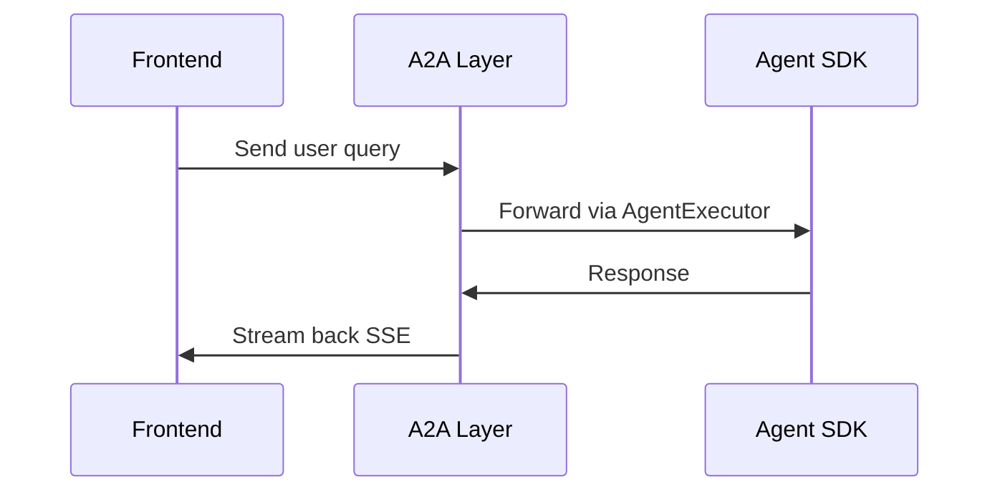
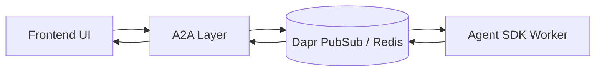
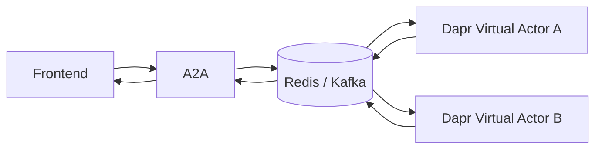
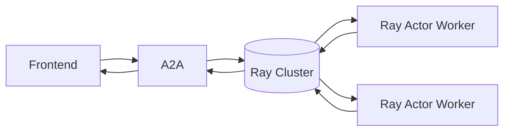
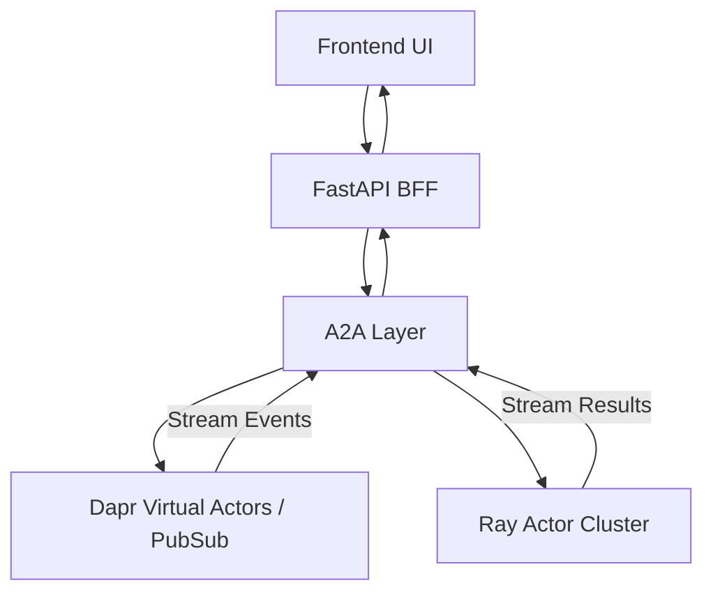

# 🌌 Infinite Agent Streams

**Infinite Agent Streams** is a playground for experimenting with **streaming multi-agent systems** across different runtimes and patterns.
It provides progressive “recipes” (R1 → R4) to explore **A2A protocol**, **Dapr Virtual Actors**, **PubSub transports**, and **Ray Actors**, all tied together with a frontend inspector UI. The agentic engine is `OpenAI Agents SDK` and can be swapped with any Agentic Framework.

---

## 🚀 Vision

Build a foundation for **scalable, streaming-first AI agents** that can run in the cloud, collaborate in real time, and scale from lightweight demos to production-grade deployments.

Key themes:

* 📡 **Streaming-first** (SSE / WebSocket / PubSub)
* 🎭 **Actors as Agents** (Dapr + Ray)
* 🔌 **Pluggable Transports** (Dapr PubSub, Redis, Ray Streams, A2A protocol)
* 🖼️ **Multi-Modal Extensions** (text, image, video, voice, attachments)
* 🛠️ **Custom UI Inspector** (for debugging + visualization)

---

## 📂 Repository Layout

Each recipe is fully self-contained with code, setup steps, and docs:

```
infinite-agent-streams/
│
├── r1-a2a-agents/
├── r2-a2a-agents-dapr-pubsub/
├── r3-a2a-dapr-actors/
├── r4-a2a-ray-actors/
│
├── edition-modalities/   # Extra: Image, Video, Voice, Attachments
├── ui-inspector/         # Custom frontend for visualization
└── README.md
```

---

## 🔑 Recipes

### **[R1: A2A + Agents SDK (Zero Cost Baseline Stack)](./r1-a2a-agents/README.md)**

* Pure A2A with Agents SDK.
* Stateless interactions over HTTP transport.
* Best for minimal **ping-pong agent demo**.



This recipe runs everything in **one container + one FastAPI server** — keeping things **simple and cost-free**.
Perfect if you **don’t know Kubernetes yet** or want to deploy on **serverless containers** (Fly.io, Railway, Render, etc.).

```
+--------------------------------------+
|         🚀 Single Container           |
|                                      |
|  +-----------+   +-------------+     |
|  |   A2A     |   |     BFF     |     |
|  |  Server   |<->|   (API)     |     |
|  +-----------+   +-------------+     |
|          \             |             |
|           \            |             |
|            \           v             |
|          +------------------+        |
|          |   AI Agent(s)    |        |
|          |  (OpenAI, etc.)  |        |
|          +------------------+        |
|                                      |
+--------------------------------------+
```

⚡ No extra infra required. 👉 See [r1-a2a-agents/README.md](./r1-a2a-agents/README.md) for full setup instructions.

---

### **R2: A2A + Agents SDK + Dapr PubSub**

* Adds **Dapr PubSub** (e.g., Redis) for scalable async streaming.
* Decouples A2A from agent runtime.



---

### **R3: A2A + Agents SDK + Dapr Virtual Actors + PubSub**

* Each agent = **Dapr Virtual Actor** with state + concurrency safety.
* Uses PubSub for event-driven streaming.
* Ideal for **multi-agent collaboration**.



---

### **R4: A2A + Ray Actors (Scalable Compute)**

* Integrates **Ray Actors** for heavy compute / distributed workloads.
* A2A orchestrates Ray Actors just like Dapr ones.
* Use case: LLM pipelines, simulations, ML model serving.



---

## 🎨 Edition: Modalities & Custom UI

* Extend agents with **Image, Video, Voice, and File Attachments**.
* Provide a **Custom Inspector UI** for monitoring multi-agent streams.
* Full **E2E streaming demo** with interactive visualizations.

---

## 📐 Architecture Overview



* **BFF (Backend for Frontend)** = FastAPI with SSE/WebSockets.
* **A2A** = common protocol layer for streaming.
* **Dapr / Ray** = interchangeable agent runtimes.

---

## ⚖️ Why These Choices?

* **Dapr PubSub** → Abstracts Kafka, Redis, RabbitMQ.
* **Dapr Actors** → Lightweight, stateful, event-driven agents.
* **Ray Actors** → Scalable compute and distributed tasks.
* **A2A Protocol** → Standardized agent-to-agent communication.
* **FastAPI BFF** → Simple frontend bridge for real-time SSE/WebSocket.

---

## ⚖️ Ray vs Dapr vs Both

| Runtime  | Best For                                                           | Limitation                                                   |
| -------- | ------------------------------------------------------------------ | ------------------------------------------------------------ |
| **Dapr** | Cloud-native agents, service integration, Pub/Sub, stateful actors | Actors don’t natively stream (need Pub/Sub or WS)            |
| **Ray**  | Heavy compute, agent swarms, distributed ML tasks                  | Python-only, not ideal for service mesh or infra integration |
| **Both** | Dapr orchestrates, Ray executes massive parallel workloads         | More moving parts, hybrid setup                              |

👉 Use **Dapr** if your priority is cloud infra + streaming.
👉 Use **Ray** if your priority is distributed compute.
👉 Use **Both** when you need *scalable infra + scalable compute*.

---

## 🛠️ Development Setup

1. Clone repo:

   ```bash
   git clone https://github.com/mjunaidca/infinite-agent-streams.git
   cd infinite-agent-streams
   ```

2. Install deps:

3. Run a recipe:

4. Start inspector UI:

---

---

## 🤝 Contributing

* Each recipe is standalone → PRs should add a new recipe or improve an existing one.
* Use GitHub Issues for design discussions.
* Add diagrams and documentation for clarity.

---

## 🔮 Future Roadmap

* [ ] Realtime media infra (WebRTC, LiveKit)
* [ ] Observability (OpenTelemetry + Jaeger)
* [ ] WASM agents in sidecars
* [ ] Hybrid K8s cluster (Dapr + Ray)
* [ ] Expand A2A to realtime transport (beyond HTTP-only)

---

## 📜 License

MIT – open for experimentation, learning, and building the future of agent streaming systems.

---

## 🎯 Vision

A **cloud-native runtime for AI agents** that is:

* **Streaming-first**
* **Scalable by design**
* **Modular** (plug in LangGraph, AutoGen, CrewAI, etc. via A2A)

This repo is an **idea lab**: fork, extend, and contribute recipes that push multi-agent systems forward.

---