```mermaid
flowchart LR
  FE[Frontend] <--> A2A
  A2A --> Executor
  Executor --> DaprPubSub[📡 Dapr PubSub]
  DaprPubSub --> OpenAI[OpenAI Agent]
  OpenAI --> DaprPubSub --> Executor --> FE
```

```mermaid
flowchart LR
  FE[Frontend] <--> A2A
  A2A --> Executor
  Executor --> DaprActor[🎭 Dapr Virtual Actor]
  DaprActor --> DaprPubSub
  DaprPubSub --> OpenAI[OpenAI Agent]
  OpenAI --> DaprPubSub --> DaprActor --> Executor --> FE
```

# 🌌 Infinite Agent Streams

**Infinite Agent Streams** is an experimental lab exploring **scalable, streaming-first multi-agent systems in cloud**.

It combines the **A2A (Agent-to-Agent) protocol**, **Agents SDK**, and **Dapr building blocks** (PubSub + Virtual Actors) to build recipes that demonstrate how AI agents can stream outputs and coordinate at scale.

This repo is an **exploration sandbox** – progressive recipes evolve from a minimal setup (R1) to a streaming end-to-end demo with multimodal support (Edition).

A final polished version of this work will later live in the [DACA Community Agent Streams](https://github.com/mjunaidca) repository.

---

## 📜 Recipes Overview

### ✅ R1: A2A + Agents SDK (Baseline)

- Agents connected over the **A2A protocol**.
- Uses the **Agents SDK** for orchestration.
- Streams responses back to frontend via SSE.

**Diagram:**


---

### ✅ R2: A2A + Agents SDK + Dapr PubSub

- Introduces **Dapr PubSub** as a transport abstraction.
- Agents publish/subscribe to streams for decoupling.

**Diagram:**



---

### ✅ R3: A2A + Agents SDK + Dapr Virtual Actors + PubSub

- Adds **Dapr Virtual Actors** for **stateful AI agents**.
- Each agent can maintain memory, personality, and lifecycle.
- PubSub streams events between actors.

**Diagram:**



---

### 🎬 Edition: Multimodal & End-to-End Streaming

- Extends R3 with **image, video, voice, and attachments**.
- Custom frontend UI beyond Inspector for multimodal demo.
- Full **streaming pipeline** E2E (agents → Dapr → frontend).

---

## 🏗️ Repo Structure

```
infinite-agent-streams/
│
├───── r1_a2a_agents_sdk/
├───── r2_a2a_dapr_pubsub/
├───── r3_a2a_dapr_actors_pubsub/
├───── edition_multimodal/
│
├── docs/
│   ├── diagrams/         # Mermaid/PlantUML diagrams
│   └── notes/            # Architecture explorations
│
├── a2a-inspector/        # Official Inspector
├── frontend/             # Custom UI
├── k8s/                  # Helm charts / manifests
└── README.md
```

---

## 🚀 Getting Started

### Prerequisites

- Docker + Kubernetes (Kind or K3d recommended)
- [Dapr CLI](https://docs.dapr.io/getting-started/install-dapr/)
- [A2A SDK](https://github.com/openai/agent-to-agent) (experimental)
- Python 3.10+

### Running

```bash
# Clone repo
git clone https://github.com/mjunaidca/infinite-agent-streams
cd infinite-agent-streams


```

---

## 🌐 Vision

This repo is an **exploration lab**:

- Each recipe gets you closer to **scalable, streaming-first agent architectures**.
- Final polished version will live as **DACA Agent Streams** → part of the **Dapr Agentic Cloud Ascent** community implementation.

---

## 📅 Roadmap

- [x] R1: A2A + Agents SDK
- [x] R2: Add Dapr PubSub
- [ ] R3: Add Dapr Virtual Actors
- [ ] Edition: Multimodal demo
- [ ] Custom frontend UI
- [ ] End-to-end streaming showcase

---

## 🤝 Contributing

This is experimental, messy code is welcome!
Open an issue if you have ideas or want to collaborate.

---
